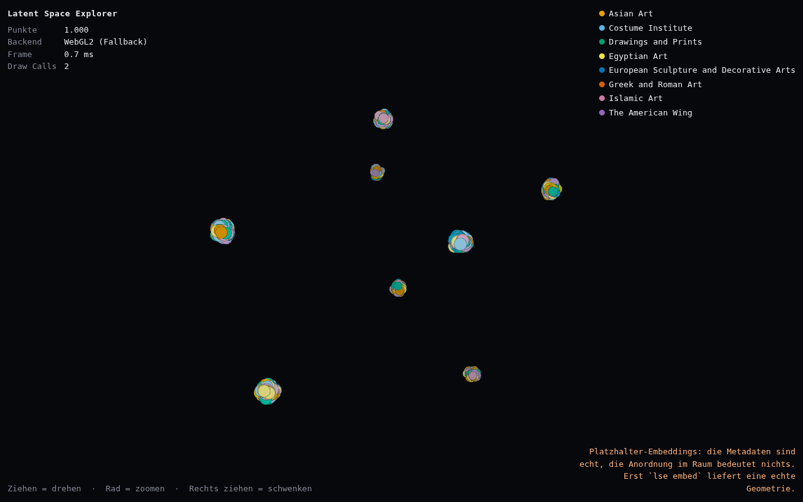
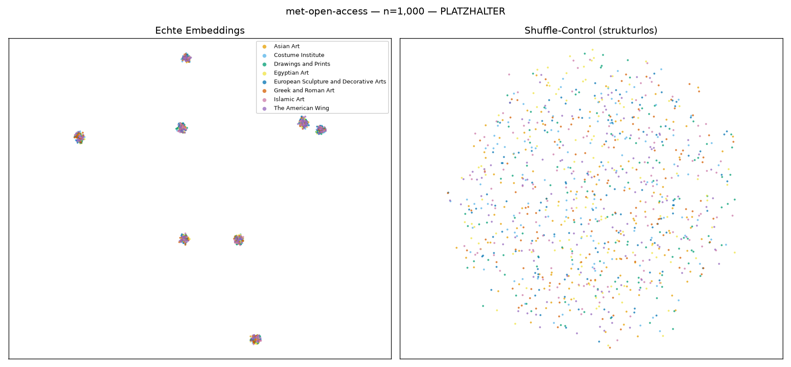

# Latent Space Explorer

Ein 3D-Raum aus den internen Zahlen eines echten ML-Modells. Zehntausende Kunstwerke werden durch ein
Bild-Text-Modell geschickt, die Embeddings auf drei Dimensionen reduziert und im Browser als Wolke
dargestellt, durch die man sich bewegt. Ähnliches liegt nah beieinander. Man tippt eine Phrase, und
sie landet an der Stelle, an die sie gehört.

**Status:** Phase 0b — die Pipeline läuft von der Met-CSV bis in den Browser. Es fehlt genau ein
Schritt: die Bilder und das Modell, beides gesperrt in der Entwicklungsumgebung
(siehe [Lokal ausführen](#lokal-ausführen)).



---

## Was hier drin ist

```
pipeline/     Python. Korpus, Embeddings, Projektion, Validierung.
viewer/       Vite + three.js. Der begehbare Raum.
data/         Artefakte. Gitignored, ausser data/sample/.
docs/         Entscheidungen und das Review, das zu ihnen gefuehrt hat.
config.toml   Einzige Wahrheitsquelle fuer Korpus, Modell und Parameter.
```

**Die zentrale architektonische Tatsache:** `pipeline/` und `viewer/` kommunizieren ausschließlich
über Dateien auf der Platte. Keine Imports, kein laufender Prozess dazwischen. Das
Artefaktverzeichnis mit seinem `manifest.json` ist die eigentliche API des Projekts — beschrieben in
[`pipeline/src/lse/artifacts.py`](pipeline/src/lse/artifacts.py), und wer eine Seite ändert, muss die
andere mit ändern.

**ID-Invariante, gilt überall:** der Zeilenindex *ist* die ID. Korpus, Embeddings, Koordinaten,
Farben und Nachbarn werden in identischer Reihenfolge geschrieben.

---

## Loslegen

Voraussetzungen: Python ≥ 3.11 mit [uv](https://docs.astral.sh/uv/), Node 22.

```bash
# Pipeline
uv sync --project pipeline --group dev
uv run --project pipeline lse doctor

# Viewer
cd viewer && npm ci && npm run dev
```

Ein frischer Klon rendert sofort etwas: `data/sample/` mit 1.000 Punkten ist eingecheckt, der Viewer
braucht dafür **kein Python**.

Nützliche Befehle:

```bash
# Was ist installiert, was sagt die Config, welche Hosts sind erreichbar
uv run --project pipeline lse doctor --network

# Synthetischen Artefaktsatz erzeugen (entkoppelt den Viewer von Modell und Korpus)
uv run --project pipeline lse synth --n 1000 --out data/sample
uv run --project pipeline lse synth --n 1000000 --out data/stress   # Renderer-Lasttest

# Artefaktsatz gegen sein Manifest pruefen
uv run --project pipeline lse verify data/sample

# Tests
uv run --project pipeline pytest
```

---

## Lokal ausführen

Die Pipeline hat fünf Schritte. Drei laufen überall, zwei brauchen Hosts, die in der
Entwicklungsumgebung durch eine Egress-Richtlinie gesperrt sind:

```bash
uv run --project pipeline lse fetch --n 1000   # Met-CSV -> gefilterte Auswahl
uv run --project pipeline lse images           # braucht images.metmuseum.org
uv run --project pipeline lse embed            # braucht huggingface.co + GPU
uv run --project pipeline lse project          # Projektion + Go/No-Go-Tor
uv run --project pipeline lse verify data/runs/dev
```

Für `embed` zusätzlich die Modellabhängigkeiten installieren:

```bash
uv sync --project pipeline --extra embed
```

`images` und `embed` sind beide **wiederaufnehmbar**: ein Abbruch kostet höchstens den laufenden
Batch. `images` führt ein `done.jsonl`, `embed` schreibt Shards.

Ohne diese beiden Schritte funktioniert alles andere trotzdem — `lse project --placeholder` baut
einen Raum aus echten Metadaten und **bedeutungsloser Geometrie**, klar markiert im Manifest und
sichtbar im Viewer. Das ist die Grundlage, auf der die Interaktion gebaut wird, nicht ein Ergebnis.

### Das Go/No-Go-Tor

`lse project` entscheidet, ob der Raum etwas bedeutet, und schreibt `gate.png` und `gate.json`.
Nachfolgend der Lauf mit **Platzhalter-Embeddings** — er ist durchgefallen, und genau das belegt,
dass das Tor funktioniert:



Links acht makellose Cluster — jeder davon ein Gemisch aus allen acht Abteilungen. kNN-Overlap 0,246
und Trustworthiness 0,957 sehen beide hervorragend aus. Die Label-Reinheit in 3D liegt aber bei
**0,126 gegen ein Zufallsniveau von 0,125**: die Cluster existieren, sie bedeuten nur nichts. Ein
Blick auf den Plot allein hätte „sieht super aus" gesagt.

Rechts der Shuffle-Control. Er permutiert **jede Dimension unabhängig**, nicht die Zeilen — Zeilen zu
mischen ergäbe dieselbe Punktmenge in anderer Reihenfolge, und UMAP fände exakt dieselbe
Mannigfaltigkeit.

---

## Wie es gebaut wird

In Phasen, jede mit einem Ausstiegskriterium. Der vollständige Plan steht in
[`docs/review-2026-08-03.md`](docs/review-2026-08-03.md), Abschnitt 10.

| Phase | Inhalt | Fertig, wenn … |
|---|---|---|
| **0a** | Entscheiden und Gerüst | `uv run` und `npm run dev` starten auf frischem Klon sauber ✅ |
| **0b** | Walking Skeleton, N = 1.000 | 1.000 echte Punkte im Browser ✅, Tor grün ⏳ (braucht `lse embed`) |
| **1** | Embeddings in Zielgröße | N Embeddings mit Manifest, Lauf nach `kill -9` wiederaufnehmbar |
| **2** | Projektion + Transform-Entscheidung | Koordinaten normalisiert, kNN-Overlap gemessen |
| **3** | Renderer in Zielgröße | Voller Korpus bei 60 fps, Sample rendert ohne Python |
| **4a–c** | Klick, Filter, Suche, Live-Prompt | jeweils einzeln |
| **5** | Ausliefern | Eine fremde Person mit nur der URL kann eine Phrase tippen und hinfliegen |

**Das Go/No-Go-Tor in Phase 0b** ist der wichtigste Punkt im Plan. UMAP erzeugt aus reinem
Gauß-Rauschen überzeugend aussehende Cluster — ein Sichtcheck kann also nicht durchfallen. Geprüft
wird deshalb gegen einen **Shuffle-Control** (dieselbe Pipeline auf gemischten Embeddings) und mit
einer Zahl (kNN-Overlap hochdimensional vs. 3D). Trennen sich bekannte Labels nicht: **Korpus
wechseln, nicht Parameter tunen.**

---

## Anti-Ziele

Bewusst *nicht* gebaut. Steht hier, damit es dabei bleibt:

- **Kein Allzweckwerkzeug.** Ein Korpus, ein Modell, festverdrahtet in den Codepfaden. Eine
  Config-Datei mit sechs Abschnitten, kein Plugin-System, keine austauschbaren Reduktionsverfahren.
- **Keine Analyseplattform.** Der Wert liegt in Navigation und Immersion, nicht in Messgenauigkeit.
  UMAP-Abstände sind ohnehin nicht bedeutsam — deshalb zeigt der Viewer die *echten*
  hochdimensionalen Nachbarn an, statt so zu tun, als wären die 3D-Abstände eine Aussage.
- **Kein Backend als Voraussetzung.** Rendern, Klicken, Filtern und Stichwortsuche laufen statisch.
  Der Live-Prompt ebenfalls — deshalb kNN-Zentroid statt `umap.transform()`.
- **Keine Nutzerkonten, keine gespeicherten Sitzungen, keine Sammlungen.** Der Zustand steckt im
  URL-Hash. Das reicht.

---

## Fertig heißt

> Eine öffentliche URL, unter der eine fremde Person eine Phrase tippt und dorthin fliegt. Ein README
> mit einem GIF und einem Befehl, der die Daten regeneriert.

Kein Feature-Katalog, sondern ein Artefakt. Ohne definierten Endzustand hat das Projekt keinen Grund,
je aufzuhören — und würde es auch nicht.

---

## Entscheidungen

Die vier tragenden Festlegungen, jeweils mit Begründung in [`docs/decisions.md`](docs/decisions.md):

- **E1 Korpus:** Met Museum Open Access. Ausschlaggebend war CC0 — die Thumbnails dürfen selbst
  gehostet werden.
- **E3 Renderer:** `three@0.185.1` exakt gepinnt, `WebGPURenderer`, Punkte als **instanzierte Quads**,
  nie `gl.POINTS`. Letzteres wäre auf Apple Silicon still auf 64 px geklemmt worden und hätte unter
  WebGPU 1×1 Pixel gerendert.
- **E4 Live-Prompt:** kNN-Zentroid statt `umap.transform()`. Umgeht Modality Gap, Modellgröße und
  Pickle-Fragilität in einem Zug.
- **E5 Navigation:** Orbit um ein bewegliches Ziel, Doppelklick fliegt hin. Free-Fly bleibt als
  begrenzter Toggle — eine UMAP-Wolke ist ein Objekt, kein Ort.

## Daten und Lizenz

Metadaten und Bilder stammen aus [The Met Open Access](https://www.metmuseum.org/hubs/open-access)
(CC0). `data/` ist gitignored und wird regeneriert; **kein git-lfs** — das macht ein Repo
klon-feindlich. Ausgeliefert werden die Artefakte als Release-Assets. Einzige Ausnahme:
`data/sample/` mit 1.000 Punkten ist eingecheckt, damit ein frischer Klon sofort etwas anzeigt.
